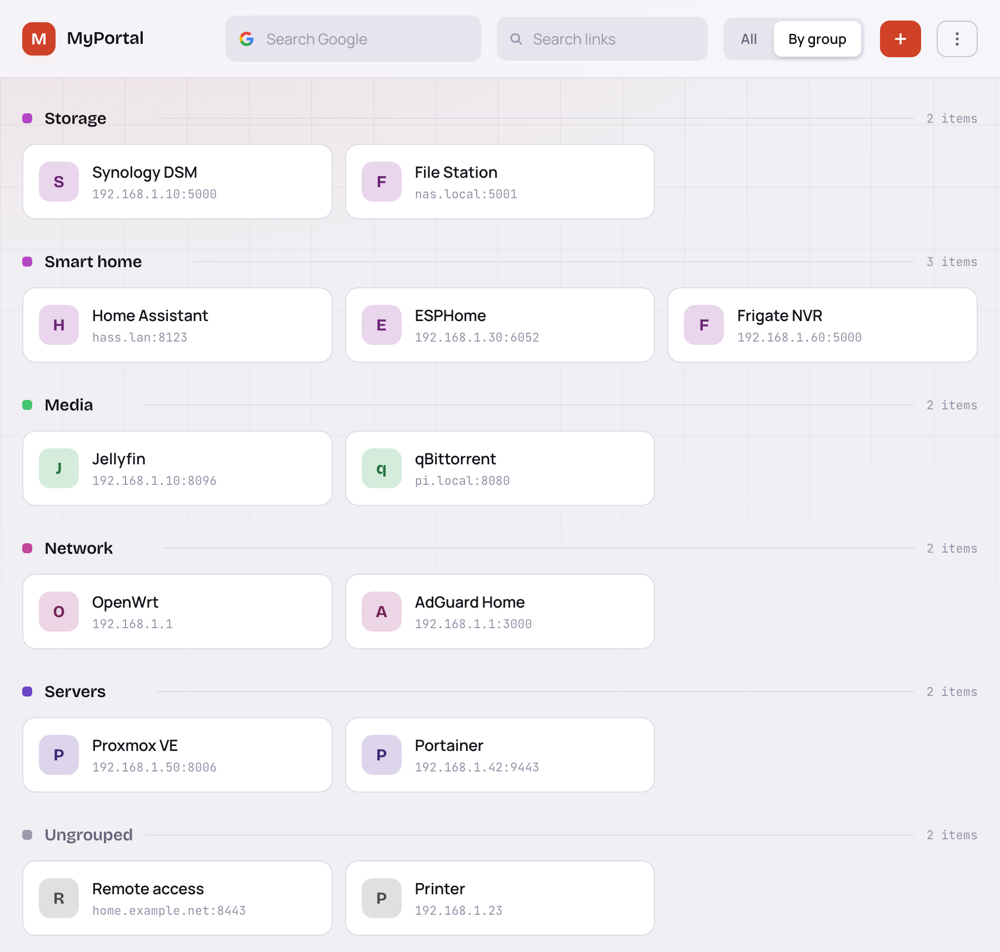
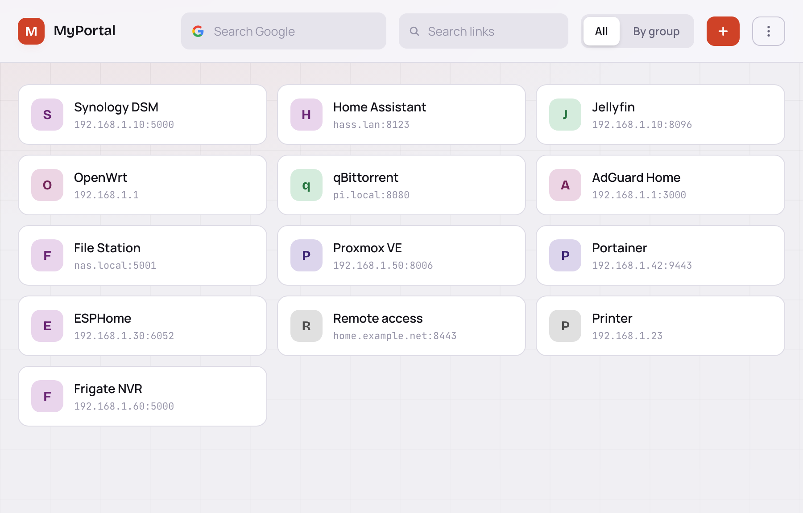

# MyPortal

A single page that collects every web UI on the home network — router, NAS,
Home Assistant, Proxmox, the printer — so nobody has to remember which box was
on which port. No login: open it and click.



## What it does

- **Add, edit and delete links in the page.** Nothing to hand-edit.
- **Sorted by how often you open them.** The order is fixed while the page is
  open so nothing jumps around under the cursor; new links start at the front
  and settle down on their own.
- **Groups are optional.** Type a name that does not exist yet and it gets
  created on save. Drag group headers to reorder, click the pencil to rename.
  Every card is coloured by its group, so grouping still reads in the flat view.
- **Export / import** the whole config as JSON.

Or drop the grouping and put everything on one screen, most-opened first:



## Running it

```bash
CONNECTION_STRING='Server=host;Port=5432;Database=web_portal;Username=postgres;Password=secret' dotnet run
```

Then open <http://localhost:8080>. `PORT` changes the port.

## Deploying

Build a self-contained Linux binary — the target then needs no .NET runtime:

```bash
dotnet publish -c Release -r linux-x64 --self-contained true -o out
```

Copy `out/` and `deploy/` onto the target machine and run the installer as root:

```bash
sudo deploy/install.sh out
```

It puts the binary in `/opt/home-portal`, installs the systemd unit and starts it
on port 80. The connection string goes in `/etc/home-portal.env`, mode 600 and
root-only — copy `home-portal.env.example`, fill it in, and the installer picks it
up from `deploy/home-portal.env`.

## Database

PostgreSQL. The two tables — `sites` and `groups` — are created at startup if
they are missing, so an empty database is all you need to point it at. There is
no schema file to run and no migration step.
